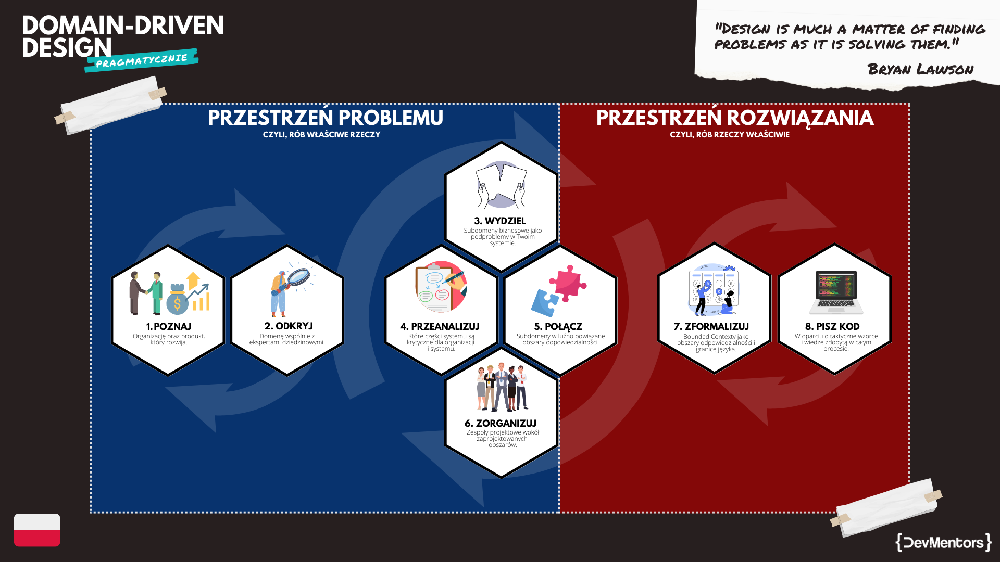

[](https://domain-driven-design.net)
_Szukasz wersji kodu, do ktorej odnosimy sie w kursie? Zajrzyj na branch **[kurs](../../tree/kurs)**_.

## Czym jest projekt `GroupFlights`?

**GroupFlights** to projekt systemu realizujacego obsluge grupowych biletow lotniczych.
To repozytorium przedstawia wynik calego proces wytwarzania oprogramowania w oparciu o **Domain-Driven Design** uwzgledniajac:
- discovery stanu AS-IS
- discovery stanu TO-BE
- destylacje subdomen
- projektowanie bounded contextow
- projektowanie integracji bounded contextow
- taktyke, tj, implementacje w oparciu o decyzje podjete na poziomie strategicznym

Suplementem do tego repozytorium jest publiczny board na **Miro**:

[](https://domain-driven-design.net/miro)

Z samym procesem "od A do Z" mozesz zapoznac sie w ramach naszego kursu ***Domain-Driven Design "Pragmatycznie***: https://domain-driven-design.net/

## Jak uruchomic?

Uruchamiamy wymagana infrastrukture:
```
docker-compose up -d
```

Nastepnie uruchamiamy bramke platnosci:
```
dotnet run --project src/_ExternalSystems/FakePaymentGateway/FakePaymentGateway.csproj
```

I w koncu nasza glowna aplikacje:
```
dotnet run --project src/Api/GroupFlights.Api/GroupFlights.Api.csproj
```

Na starcie aplikacji zostana uruchomione migracje, ktore zaloza wszystkie wymagane struktury w bazie danych.

Jesli zajdzie potrzeba, mozesz usunac wszystkie informacje z bazy danych bez potrzeby jej przegenerowywania uzywajac skryptu: [truncate-everything.sql](./scripts/truncate-everything.sql)

## Mapa procesu wytwórczego

By lepiej zrozumiec droge, jaka nalezy przejsc w ramach czesci strategicznej Domain-Driven Design warto zapoznac sie z n/w mapa procesu wytworczego:



_Inspiracja: https://github.com/ddd-crew/ddd-starter-modelling-process_

## Zalozenia

- Na architekture wdrozeniowa wybrano **modularny monolit**
- Jako baze danych wybrano **Postgres**
- Separacja modelu danych poszczegolnych modeli opiera sie o **oddzielne schematy** w ramach jednej bazy danych
- Zaleznosci pomiedzy modulami realizowane sa przy uzyciu tzw. **shared contracts**; wiecej o tym w ADR:
  - [[01] Zaleznosci pomiedzy modulami](./architecture-decisions/01-zaleznosci-pomiedzy-modulami.md)
- W zaleznosci od poziomu skomplikowania oraz klasy rozwiazywanych problemow, architektura aplikacyjna to:
  - **CRUD**, 
  - **Clean Architecture**
  - **CRUD+rich domain model**
- **Nie implementujemy uwierzytelnienia ani autoryzacji**; naiwna "imitacja" tych funkcjonalnosci opiera sie o naglowki `X-UserId` i `X-CashierId`, ktore zderzane sa z deklaracja w definicji endpointu: [NaiveAccessControl](./src/Shared/GroupFlights.Shared.ModuleDefinition/EndpointRegistration.cs#L17)
- System nie korzysta z zadnego zewnetrznego brokera wiadomosci. Elementy asynchronicznosci realizowane sa poprzez **in-memory message dispatchera** (ktory celowo z opoznieniem i poza transakcja dispatchuje zebrane zdarzenia): [EventDispatcher](./src/Shared/GroupFlights.Shared.Plumbing/Events/EventDispatcher.cs)
- Projekt zawiera tylko przykladowe testy jednostkowe, tak by zaprezentowac roznice pomiedzy **testowaniem modelu z publicznymi getterami** w [OfferDraftTests](./src/Sales/GroupFlights.Sales.Domain.UnitTests/Offers/OfferDraftTests.cs) oraz **modelu w pelni zenkapsulowanego, bez dostepu do pol i wlasciwosci** [ReservationChangeRequestTests](./src/Postsale/GroupFlights.Postsale.UnitTests/Changes/ReservationChangeRequestTests.cs)
- Na potrzeby dydaktyczne projekt implementuje **trzy podejscia do persystencji**:
  - serializacje agregatu do JSONa ([OfferRepository](./src/Sales/GroupFlights.Sales.Infrastructure/Data/Repositories/OfferRepository.cs#L31)),
  - klasyczny model relacyjny ([DeadlineConfiguration](./src/TimeManagement/GroupFlights.TimeManagement.Core/Data/EF/Configs/DeadlineConfiguration.cs))
  - model relacyjny oparty o w pelni zenkapsulowany model dziedziny ([ReservationChangeRequestConfig](./src/Postsale/GroupFlights.Postsale.Infrastructure/Data/EF/Configs/ReservationChangeRequestConfig.cs))
- System nie implementuje bramki e-mail ani notyfikacji, a jedynie przyklad wysylki e-mail poprzez zapis komunikatu do konsoli
- System nie implementuje integracji z zadnym systemem platnosci; zamiast tego opracowano sztuczna bramke imitujaca takie zachowanie wraz z "auto-platnosci" po 5s

## Dostepne scenariusze (`./src/_Scenarios`)

Dla uproszczenia przechodzenia przez poszczegolne kroki procesu biznesowego udostepnilismy pliki `.http`.

Do ich uruchomienie niezbedne jest IDE takie jak: VSCode lub JetBrains Rider.

Scenariusze nalezy wykonac w nastepujacej kolejnosci:
1. Dodanie zgloszenia przez potencjalnego klienta: [add-inquiry.http](./src/_Scenarios/Inquiries/add-inquiry.http)
2. Akceptacje zgloszenia przez kasjera: [accept-inquiry.http](./src/_Scenarios/Inquiries/accept-inquiry.http)
3. Dodanie wariantu lotu przez kasjera: [add-variant.http](./src/_Scenarios/Offers/add-variant.http)
4. Potwierdzenie wariantu lotu wraz z jego kosztem przez kasjera: [confirm-variant.http](./src/_Scenarios/Offers/confirm-variant.http)
5. Prezentacje oferty klientowi przez kasjera: [reveal-offer-draft.http](./src/_Scenarios/Offers/reveal-offer-draft.http)
6. Akceptacje oferty przez klienta: [accept-offer.http](./src/_Scenarios/Offers/accept-offer.http)
7. Przegladanie rezerwacji: [browse-reservations.http](./src/_Scenarios/Reservations/browse-reservations.http)
8. Pobranie wygenerowanej umowy przez klienta(1): [download-contract.http](./src/_Scenarios/Backoffice/download-contract.http)
9. Podpisanie wygenerowanej umowy przez klienta(1): [upload-contract.http](./src/_Scenarios/Backoffice/upload-contract.http)
10. Podanie naziwsk pasazerow przez klienta(2): [set-passengers-for-flight.http](./src/_Scenarios/Reservations/set-passengers-for-flight.http)
11. Dodanie platnika przez klienta: [add-payer.http](./src/_Scenarios/Finance/add-payer.http)
12. Ustalenie platnosci po zatwierdzeniu rezerwacji przez kasjera: [setup-reservation-payment.http](./src/_Scenarios/Reservations/setup-reservation-payment.http)
13. Deklaracje zmiany rezerwacji przez klienta(2): [request-travel-change.http](./src/_Scenarios/Postsale/request-travel-change.http)
14. Ustawienie "robialnosci" zmiany przez kasjera: [set-change-feasibility.httpp](./src/_Scenarios/Postsale/set-change-feasibility.http)

_(1) Identyfikator umowy znajduje sie na rezerwacji, ktora wyszukasz uzywajac browse-reservations.http_

_(2) Identyfikator rezerwacji znajduje sie na rezerwacji, ktora wyszukasz uzywajac browse-reservations.http_

## Wsparcie

[](https://devmentors.io/discordpl)
