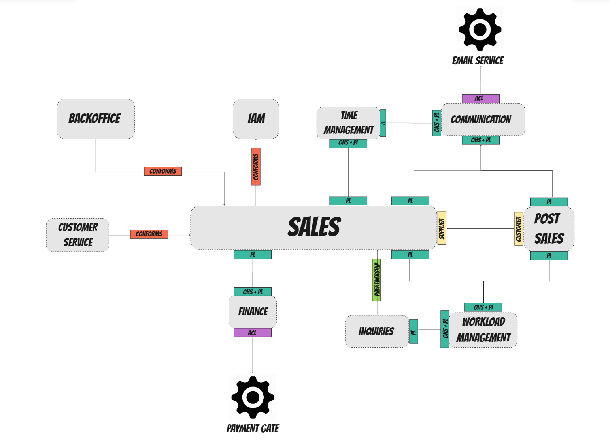

# 03 - Współpraca z innymi modułami

**Zgłaszający:** Michał Wilczyński

**Zatwierdzający:** Dariusz Pawlukiewicz

## Kontekst

W ramach fazy projektowania systemu zidentyfikowaliśmy następujące zależności pomiędzy bounded contextami, które będą narzucać nam sposób komunikacji z innymi modułami:

## Rozważane opcje

N/D

## Decyzja

Zależnie od modułu, z którym się będziemy komunikować możemy narzucić (lub nie) sposób komunikacji jak i kontrakty.

**_Za przykład wezmiemy tu moduł Sales ("Sprzedaż")_**, który jest naszym obszarem core'owym i jednocześnie najaktywniejszym jeśli chodzi o integracje z innymi modułami.

### Moduły implementujące `Open Host Service`

W przypadku modułów współpracujących z nami na zasadzie `Open Host Service` nie możemy narzucić kontraktu ani sposobu komunikacji, gdyż nie jesteśmy jedynym (obecnym lub planowanym) konsumentem.

W tym przypadku należy:
- dostosować się do kontraktu danego modułu, ew. zamykając złożność przemapowania po naszej stronie
- być stroną aktywną komunikacji, tzn. to my żądamy wykonania jakiejś operacji (sync lub async), używając kontraktu udostępnionego przez dany moduł

Moduły, których ten model współpracy dotyczy:
- Time Management ("Zarządzanie czasem")
- Communication ("Komunikacja")
- Workload Management ("Zarządzanie przydziałem pracowników")
- Finance ("Finanse")

### Moduły zależne (`Partnership`, `Conformist`, `Supplier-Customer`)

W przypadku modułów w jakichś sposób od nas zależnych możemy pozwolić sobie na (zależnie od "umocowania" w relacji) narzucenie kontraktu i sposobu komunikacji.

W tym przypadku należy:
- narzucić kontrakt publicznego API konsumentom, ew. uwzględniając ich potrzeby (`Partnership`, `Supplier-Customer`)
- oczekiwać, że to te moduły będą stroną aktywną wykonywania operacji (jawnie żądają wykonania operacji lub reagują na nasze zdarzenia wykonując potrzebne nam operacje)

Moduły, których ten model współpracy dotyczy:
- Backoffice ("Backoffice")
- Inquiries ("Zapytania")
- Post-Sale ("Posprzedaż")

## Oczekiwany wynik

Jawnie zadeklarowany model współpracy wraz z przykładami oczekiwanych integracji pozwoli na ograniczenie ryzyka paraliżu decyzyjnego pt. "kto, co i jak ma zrobić". 

## Linki

Miro