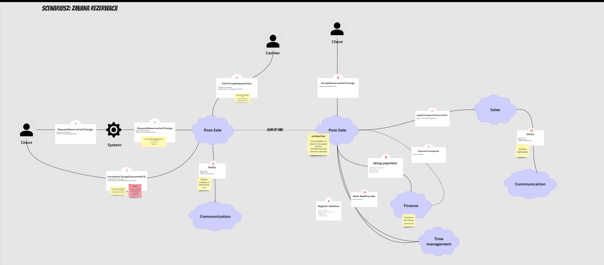
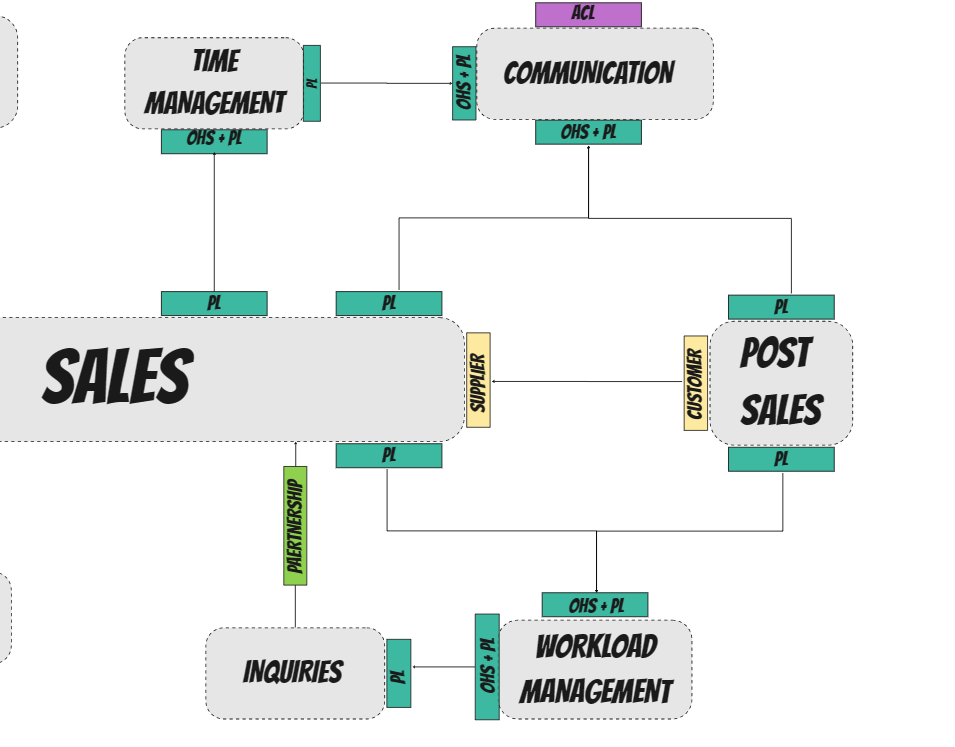

# 04 - Postsale wydzielone z Sales

**Zgłaszający:** Michał Wilczyński

**Zatwierdzający:** Dariusz Pawlukiewicz

## Kontekst

W trakcie odkrywania naszej domeny najwiecej skupialismy sie na subdomenach powiazanych z obszarem sprzedazy, tj. `ofertami`, `rezerwacjami` i powiazanymi z nimi `zmianami`.

Analizujac "rdzen" naszego procesu biznesowego oraz jego "happy path" doszlismy do wniosku, ze same zmiany sa wzgledem niego procesem rozlacznym (choc powiazanym i wspierajacym).

### Kroki zmiany rezerwacji

Zidentyfikowalismy nastepujace kroki wymagane do realizacji trudniejszej wersji zmiany rezerwacji - po wystawieniu biletow:
1. **[UI]** Deklaracja klienta o checi zmiany parametru podrozy, np. daty przelotu
2. **[Postsale -> Sales]** Pobranie z obszaru Sales uproszczonego stanu rezerwacji na moment w czasie skladania deklaracji
3. **[GDS]** Znalezienie i wycenienie (o ile "robialna") zmiany przelotu przez kasjera
4. **[UI]** Wprowadzenie propozycji zmiany do systemu
5. **[Postsale -> Finance]** Wygenerowanie platnosci (z okreslona data deadline'u), ktorej uiszczenie rowne jest akceptacji warunkow zmiany
6. **[UI -> Bramka platnosci]** Uiszczenie oplaty przez klienta
7. **[Deadline -> Postsale]** Oznaczenie deadline'u platnosci jako spelniony
8. **[Postsale -> Deadline]** Wygenerowanie "korekty" aktualnych deadline'ow rezerwacji dla platnosci i podania nazwisk pasazerow
9. **[Postsale -> Sales]** Zaaplikowanie zmiany w obszarze Sales
10 **[Sales -> Postsale]** Zamkniecie zmiany po naniesieniu wszystkich zmian w systemie

### Domain Message Flow

Dodatkowo korzystajac z techniki `Domain Message Flow Modelling` udalo nam sie (w formie piktograficznej) okreslic uproszczona sciezke naniesienia zmiany po wystawieniu biletow, ktora wydaje sie, ze jest bardziej skomplikowana niz caly proces ofertowania i rezerwacji razem wziete:

Biorac pod uwage:
- skomplikowanie tego procesu, 
- jego potencjal do destabilizacji rdzenia naszego biznesu 
- jego niewymagalnosc do realizacji glownego procesu

nalezaloby zastanowic sie jak skutecznie wyizolowac go od obszaru Sales.

## Rozważane opcje

- **Opcja #1** - pozostawienie zmian (i w przyszlosci zwrotów) w obszarze Sales
    - *Plusy*: 
        - Latwosc zmiany i integracji z Rezerwacjami w ramach jednego bounded contextu
    - *Minusy*: 
        - Duza szansa na destabilizacje lub przekomplikowanie "happy path" kosztem umieszczenia w nim zmian
- **Opcja #2** - wydzielenie zmian do oddzielnego modulu - Postsale
    - *Plusy*: 
        - Ograniczenie negatywnego wplywu na "happy path" przy okazji ukrywajac zlozonosc procesu za prostym publicznym API
    - *Minusy*:
        - Koniecznosc orkiestracji zmian nie tylko z dostepnymi capabilities (Finanse, Zarzadzanie czasem) ale rowniez z core biznesowym - obszarem Sales; 
        - koniecznosc zapewnienia minimalizacji konfliktow pomiedzy rezerwacja a zmiana (zmieniam rezerwacje na bazie nieaktualnych informacji)

## Decyzja

W wyniku fazy projektowania podjeto decyzje o wydzieleniu zmian (i kolejnych procesow satelickich sprzedazy) do oddzielnego obszaru "posprzedazy", tj. ***Postsale***.

### Rekomendacja - wysoka enkapsulacja

Obszar Postsale powinien charakteryzowac sie wysoka enkapsulacja i scislym ukrywaniem szczegolow swojej implementacji.

Zalecana jest zarowno `restrykcyjna enkapsulacja modelu dziedziny` jak i maksymalne `ograniczenie publicznego API` (***w tym modelu danych***) dostepnego dla innych obszarow czy uzytkownikow koncowych.

### Wspolpraca z obszarem Sales

Pomimo wydzielenia z obszaru Sales, procesy jak zmiana rezerwacji nie moga bez niego istniec.

Zadecydowano, ze w ramach wspolpracy Sales i Postsale, ten pierwszy (Sales) bedzie wazniejszy. Jednoczesnie wymagane bedzie udostepnieniu publicznego API (w relacji `Supplier-Customer`) dla tego drugiego (Postsale), tak by wynik swojego procesu (gotowa zmiane) mogl naniesc na istniejaca w Sales rezerwacje:

## Oczekiwany wynik

Zmiany rezerwacji wraz ze swoim skomplikowaniem zostana zamkniete w oddzielnym obszarze, produkujac jedynie artefakt gotowy do zaaplikowania w obszarze Sales.

Potencjalne turbulencje (czy tzw. `"blast radius"`) zostana ograniczone do niezbednego minimum, tak by najwazniejszy w organizacji obszar Sales byl stabiliny i przynosil zysk organizacji.

## Linki

N/D